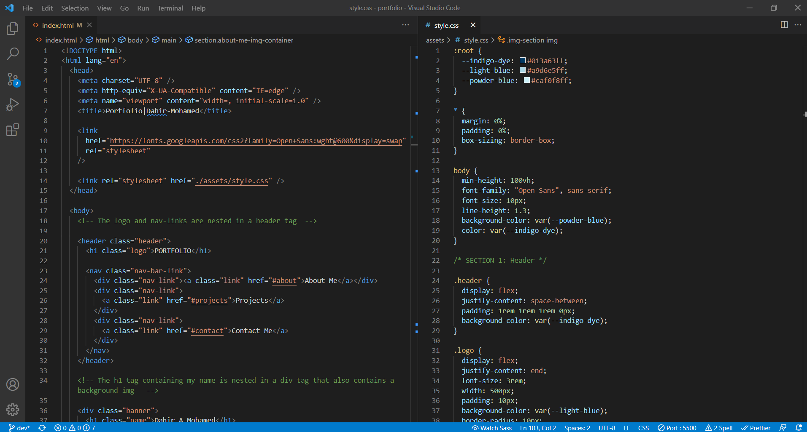

# advanced-html-css-portfolio

## Description:

Creating a work portfolio highlighting my abilities and achievements using a variety of advanced HTML and CSS skills with no frameworks.

## Complete Portfolio:

To see the full URL deployed web-application project <a href="https://dmo17.github.io/portfolio/">click here </a>

## Preview Image Of Code:

## Preview Image Of Web-page:

## Portfolio completed:

- Added an appropriate and descriptive document title
- Utilized semantic-Html tags like main, section, header and etc in appropriate places
- Added a working navigation link into the nav bar
- Added a link on the main project image that takes it to the deployed URL page.
- The main project image is larger than the rest
- Added animations and hover effects on the portfolio web-page
- Added mobile responsiveness to the web-page
